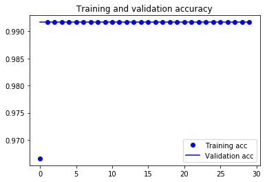
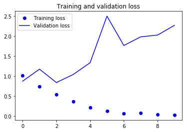
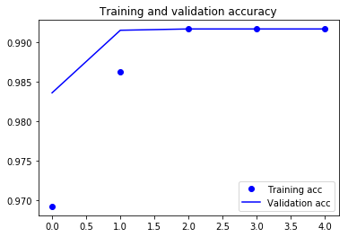

# Image Classification - Lab

## Introduction

Now that you have a working knowledge of CNNs and have practiced implementing associated techniques in Keras, its time to put all of those skills together. In this lab, you'll work to complete a Kaggle competition on classifying dog breeds.

https://www.kaggle.com/c/dog-breed-identification

## Objectives

You will be able to:
* Independently design and build a CNN for image classifcation tasks
* Compare and apply multiple techniques for tuning a model including data augmentation and adapting pretrained models

## Download and Load the Data

Start by downloading the data locally and loading it into a Pandas DataFrame. Be forewarned that this dataset is fairly large and it is advisable to close other memory intensive applications.

The data can be found here:

https://www.kaggle.com/c/dog-breed-identification/data

It's easiest if you download the data into this directory on your local computer. From there, be sure to uncompress the folder and subfolders. If you download the data elsewhere, be sure to modify the file path when importing the file below.


```python
# No code persay, but download and decompress the data.
```


```python
# __SOLUTION__ 
# No code persay, but download and decompress the data.
```

## Preprocessing

Now that you've downloaded the data, its time to prepare it for some model building! You'll notice that the current structure provided is not the same as our lovely preprocessed folders that you've been given to date. Instead, you have one large training folder with images and a csv file with labels associated with each of these file types. 

Use this to create a directory substructure for a train-validation-test split as we have done previously. Also recall that you'll also want to use one-hot encoding as you are now presented with a multi-class problem as opposed to simple binary classification.


```python
# Your code here; open the labels.csv file stored in the zip file
```


```python
# __SOLUTION__ 
import pandas as pd
```


```python
# __SOLUTION__ 
ls
```

    Baseline_CNN.h5           data_org/                 dog_breeds.zip
    CNN Pretrained DIY.ipynb  dog_breeds/               multiclass_cnfmatx.png


```python
# __SOLUTION__ 
df = pd.read_csv('dog_breeds/labels.csv')
df.head()
```


<div>
<style scoped>
    .dataframe tbody tr th:only-of-type {
        vertical-align: middle;
    }

    .dataframe tbody tr th {
        vertical-align: top;
    }

    .dataframe thead th {
        text-align: right;
    }
</style>
<table border="1" class="dataframe">
  <thead>
    <tr style="text-align: right;">
      <th></th>
      <th>id</th>
      <th>breed</th>
    </tr>
  </thead>
  <tbody>
    <tr>
      <th>0</th>
      <td>000bec180eb18c7604dcecc8fe0dba07</td>
      <td>boston_bull</td>
    </tr>
    <tr>
      <th>1</th>
      <td>001513dfcb2ffafc82cccf4d8bbaba97</td>
      <td>dingo</td>
    </tr>
    <tr>
      <th>2</th>
      <td>001cdf01b096e06d78e9e5112d419397</td>
      <td>pekinese</td>
    </tr>
    <tr>
      <th>3</th>
      <td>00214f311d5d2247d5dfe4fe24b2303d</td>
      <td>bluetick</td>
    </tr>
    <tr>
      <th>4</th>
      <td>0021f9ceb3235effd7fcde7f7538ed62</td>
      <td>golden_retriever</td>
    </tr>
  </tbody>
</table>
</div>


```python
# __SOLUTION__ 
ls dog_breeds/train/ | head -5
```

    000bec180eb18c7604dcecc8fe0dba07.jpg
    001513dfcb2ffafc82cccf4d8bbaba97.jpg
    001cdf01b096e06d78e9e5112d419397.jpg
    00214f311d5d2247d5dfe4fe24b2303d.jpg
    0021f9ceb3235effd7fcde7f7538ed62.jpg


In order to input the data into our standard pipeline, you'll need to organize the image files into a nested folder structure. At the top level will be a folder for the training data, a folder for the validation data, and a folder for the testing data. Within these top directory folders, you'll then need to create a folder for each of the categorical classes (in this case, dog breeds). Finally, within these category folders you'll then place each of the associated image files.

We wish to create our standard directory structure:
* train
    * category1
    * category2
    * category3
    ...
* val
    * category1
    * category2
    * category3
    ...
* test 
    * category1
    * category2
    * category3
    ...  

> **Hint**: To do this, you can use the `os` module which will you to use execute many common bash commands straight from your python interpreter. For example, here's how you could make a new folder:
```python
import os
os.mkdir('New_Folder_Name')
```
Start by creating top level folders for the train, validation and test sets. Then, use your pandas dataframe to split the example images for each breed of dog into a 80% train set, and 10% validation and test sets. Use `os.path.join()` with the information from the dataframe to construct the relevant file path. With this, place the relevant images using the `shutil.copy()` into the appropriate directory.


```python
# Your code here; transform the image files and then load them into Keras as tensors 
# (be sure to perform a train-val-test split)
```


```python
# __SOLUTION__ 
print('Number of unique breeds:', df.breed.nunique())
print(df.breed.value_counts()[:10])
```

    Number of unique breeds: 120
    scottish_deerhound      126
    maltese_dog             117
    afghan_hound            116
    entlebucher             115
    bernese_mountain_dog    114
    shih-tzu                112
    pomeranian              111
    great_pyrenees          111
    basenji                 110
    samoyed                 109
    Name: breed, dtype: int64


```python
# __SOLUTION__ 
import numpy as np
import os, shutil

old_dir = 'dog_breeds/train/'

new_root_dir = 'data_org/'
os.mkdir(new_root_dir)

dir_names = ['train', 'val', 'test']
for d in dir_names:
    new_dir = os.path.join(new_root_dir, d)
    os.mkdir(new_dir)
    
for breed in df.breed.unique():
    print('Moving {} pictures.'.format(breed))
    #Create sub_directories
    for d in dir_names:
        new_dir = os.path.join(new_root_dir, d, breed)
        os.mkdir(new_dir)
    #Subset dataframe into train, validate and split sets
    #Split is performed here to ensure maintain class distributions.
    temp = df[df.breed == breed]
    train, validate, test = np.split(temp.sample(frac=1), [int(.8*len(temp)), int(.9*len(temp))])
    print('Split {} imgs into {} train, {} val, and {} test examples.'.format(len(temp),
                                                                              len(train),
                                                                              len(validate),
                                                                              len(test)))
    for i, temp in enumerate([train, validate, test]):
        for row in temp.index:
            filename = temp['id'][row] + '.jpg'
            origin = os.path.join(old_dir + filename)
            destination = os.path.join(new_root_dir + dir_names[i] + '/' + breed + '/' + filename)
            shutil.copy(origin, destination)
```


```python
# __SOLUTION__ 
# Your code here
from keras.preprocessing.image import ImageDataGenerator

train_dir = 'data_org/train'
validation_dir = 'data_org/val/'
test_dir = 'data_org/test/'

# All images will be rescaled by 1./255
train_datagen = ImageDataGenerator(rescale=1./255)
test_datagen = ImageDataGenerator(rescale=1./255)

train_generator = train_datagen.flow_from_directory(
        # This is the target directory
        train_dir,
        # All images will be resized to 150x150
        target_size=(150, 150),
        batch_size=20,
        class_mode='categorical')

validation_generator = test_datagen.flow_from_directory(
        validation_dir,
        target_size=(150, 150),
        batch_size=20,
        class_mode='categorical')
```

    /Users/matthew.mitchell/anaconda3/lib/python3.6/site-packages/h5py/__init__.py:36: FutureWarning: Conversion of the second argument of issubdtype from `float` to `np.floating` is deprecated. In future, it will be treated as `np.float64 == np.dtype(float).type`.
      from ._conv import register_converters as _register_converters
    Using TensorFlow backend.


    Found 8127 images belonging to 120 classes.
    Found 1017 images belonging to 120 classes.


```python
# __SOLUTION__ 
train_generator.class_indices
```


    {'affenpinscher': 0,
     'afghan_hound': 1,
     'african_hunting_dog': 2,
     'airedale': 3,
     'american_staffordshire_terrier': 4,
     'appenzeller': 5,
     'australian_terrier': 6,
     'basenji': 7,
     'basset': 8,
     'beagle': 9,
     'bedlington_terrier': 10,
     'bernese_mountain_dog': 11,
     'black-and-tan_coonhound': 12,
     'blenheim_spaniel': 13,
     'bloodhound': 14,
     'bluetick': 15,
     'border_collie': 16,
     'border_terrier': 17,
     'borzoi': 18,
     'boston_bull': 19,
     'bouvier_des_flandres': 20,
     'boxer': 21,
     'brabancon_griffon': 22,
     'briard': 23,
     'brittany_spaniel': 24,
     'bull_mastiff': 25,
     'cairn': 26,
     'cardigan': 27,
     'chesapeake_bay_retriever': 28,
     'chihuahua': 29,
     'chow': 30,
     'clumber': 31,
     'cocker_spaniel': 32,
     'collie': 33,
     'curly-coated_retriever': 34,
     'dandie_dinmont': 35,
     'dhole': 36,
     'dingo': 37,
     'doberman': 38,
     'english_foxhound': 39,
     'english_setter': 40,
     'english_springer': 41,
     'entlebucher': 42,
     'eskimo_dog': 43,
     'flat-coated_retriever': 44,
     'french_bulldog': 45,
     'german_shepherd': 46,
     'german_short-haired_pointer': 47,
     'giant_schnauzer': 48,
     'golden_retriever': 49,
     'gordon_setter': 50,
     'great_dane': 51,
     'great_pyrenees': 52,
     'greater_swiss_mountain_dog': 53,
     'groenendael': 54,
     'ibizan_hound': 55,
     'irish_setter': 56,
     'irish_terrier': 57,
     'irish_water_spaniel': 58,
     'irish_wolfhound': 59,
     'italian_greyhound': 60,
     'japanese_spaniel': 61,
     'keeshond': 62,
     'kelpie': 63,
     'kerry_blue_terrier': 64,
     'komondor': 65,
     'kuvasz': 66,
     'labrador_retriever': 67,
     'lakeland_terrier': 68,
     'leonberg': 69,
     'lhasa': 70,
     'malamute': 71,
     'malinois': 72,
     'maltese_dog': 73,
     'mexican_hairless': 74,
     'miniature_pinscher': 75,
     'miniature_poodle': 76,
     'miniature_schnauzer': 77,
     'newfoundland': 78,
     'norfolk_terrier': 79,
     'norwegian_elkhound': 80,
     'norwich_terrier': 81,
     'old_english_sheepdog': 82,
     'otterhound': 83,
     'papillon': 84,
     'pekinese': 85,
     'pembroke': 86,
     'pomeranian': 87,
     'pug': 88,
     'redbone': 89,
     'rhodesian_ridgeback': 90,
     'rottweiler': 91,
     'saint_bernard': 92,
     'saluki': 93,
     'samoyed': 94,
     'schipperke': 95,
     'scotch_terrier': 96,
     'scottish_deerhound': 97,
     'sealyham_terrier': 98,
     'shetland_sheepdog': 99,
     'shih-tzu': 100,
     'siberian_husky': 101,
     'silky_terrier': 102,
     'soft-coated_wheaten_terrier': 103,
     'staffordshire_bullterrier': 104,
     'standard_poodle': 105,
     'standard_schnauzer': 106,
     'sussex_spaniel': 107,
     'tibetan_mastiff': 108,
     'tibetan_terrier': 109,
     'toy_poodle': 110,
     'toy_terrier': 111,
     'vizsla': 112,
     'walker_hound': 113,
     'weimaraner': 114,
     'welsh_springer_spaniel': 115,
     'west_highland_white_terrier': 116,
     'whippet': 117,
     'wire-haired_fox_terrier': 118,
     'yorkshire_terrier': 119}


## Optional: Build a Baseline CNN

This is an optional step. Adapting a pretrained model will produce better results, but it may be interesting to create a CNN from scratch as a baseline. If you wish to, do so here.


```python
# Create a baseline CNN model
```


```python
# __SOLUTION__ 
import datetime

original_start = datetime.datetime.now()
start = datetime.datetime.now()
```


```python
# __SOLUTION__ 
from keras import layers
from keras import models
from keras import optimizers

model = models.Sequential()
model.add(layers.Conv2D(32, (3, 3), activation='relu',
                        input_shape=(150, 150, 3)))
model.add(layers.MaxPooling2D((2, 2)))
model.add(layers.Conv2D(64, (3, 3), activation='relu'))
model.add(layers.MaxPooling2D((2, 2)))
model.add(layers.Conv2D(128, (3, 3), activation='relu'))
model.add(layers.MaxPooling2D((2, 2)))
model.add(layers.Conv2D(128, (3, 3), activation='relu'))
model.add(layers.MaxPooling2D((2, 2)))
model.add(layers.Flatten())
model.add(layers.Dense(64, activation='relu'))
model.add(layers.Dense(128, activation='relu'))
model.add(layers.Dense(256, activation='relu'))
model.add(layers.Dense(512, activation='relu'))
model.add(layers.Dense(120, activation='sigmoid'))


model.compile(loss='categorical_crossentropy',
              optimizer=optimizers.RMSprop(lr=1e-4),
              metrics=['acc'])

history = model.fit_generator(
      train_generator,
      steps_per_epoch=100,
      epochs=30,
      validation_data=validation_generator,
      validation_steps=50)
```

    Epoch 1/30
    100/100 [==============================] - 80s 805ms/step - loss: 0.1220 - acc: 0.9666 - val_loss: 0.0516 - val_acc: 0.9917
    Epoch 2/30
    100/100 [==============================] - 80s 799ms/step - loss: 0.0515 - acc: 0.9917 - val_loss: 0.0509 - val_acc: 0.9917
    Epoch 3/30
    100/100 [==============================] - 81s 807ms/step - loss: 0.0510 - acc: 0.9917 - val_loss: 0.0503 - val_acc: 0.9917
    Epoch 4/30
    100/100 [==============================] - 80s 800ms/step - loss: 0.0503 - acc: 0.9917 - val_loss: 0.0498 - val_acc: 0.9917
    Epoch 5/30
    100/100 [==============================] - 82s 821ms/step - loss: 0.0500 - acc: 0.9917 - val_loss: 0.0495 - val_acc: 0.9917
    Epoch 6/30
    100/100 [==============================] - 82s 816ms/step - loss: 0.0497 - acc: 0.9917 - val_loss: 0.0496 - val_acc: 0.9917
    Epoch 7/30
    100/100 [==============================] - 82s 815ms/step - loss: 0.0493 - acc: 0.9917 - val_loss: 0.0493 - val_acc: 0.9917
    Epoch 8/30
    100/100 [==============================] - 85s 847ms/step - loss: 0.0493 - acc: 0.9917 - val_loss: 0.0487 - val_acc: 0.9917
    Epoch 9/30
    100/100 [==============================] - 81s 810ms/step - loss: 0.0491 - acc: 0.9917 - val_loss: 0.0491 - val_acc: 0.9917
    Epoch 10/30
    100/100 [==============================] - 82s 815ms/step - loss: 0.0490 - acc: 0.9917 - val_loss: 0.0487 - val_acc: 0.9917
    Epoch 11/30
    100/100 [==============================] - 81s 814ms/step - loss: 0.0490 - acc: 0.9917 - val_loss: 0.0488 - val_acc: 0.9917
    Epoch 12/30
    100/100 [==============================] - 85s 852ms/step - loss: 0.0489 - acc: 0.9917 - val_loss: 0.0485 - val_acc: 0.9917
    Epoch 13/30
    100/100 [==============================] - 84s 844ms/step - loss: 0.0489 - acc: 0.9917 - val_loss: 0.0485 - val_acc: 0.9917
    Epoch 14/30
    100/100 [==============================] - 85s 848ms/step - loss: 0.0487 - acc: 0.9917 - val_loss: 0.0493 - val_acc: 0.9917
    Epoch 15/30
    100/100 [==============================] - 85s 847ms/step - loss: 0.0488 - acc: 0.9917 - val_loss: 0.0485 - val_acc: 0.9917
    Epoch 16/30
    100/100 [==============================] - 85s 849ms/step - loss: 0.0487 - acc: 0.9917 - val_loss: 0.0486 - val_acc: 0.9917
    Epoch 17/30
    100/100 [==============================] - 84s 841ms/step - loss: 0.0486 - acc: 0.9917 - val_loss: 0.0483 - val_acc: 0.9917
    Epoch 18/30
    100/100 [==============================] - 83s 828ms/step - loss: 0.0486 - acc: 0.9917 - val_loss: 0.0484 - val_acc: 0.9917
    Epoch 19/30
    100/100 [==============================] - 85s 849ms/step - loss: 0.0485 - acc: 0.9917 - val_loss: 0.0484 - val_acc: 0.9917
    Epoch 20/30
    100/100 [==============================] - 85s 846ms/step - loss: 0.0485 - acc: 0.9917 - val_loss: 0.0485 - val_acc: 0.9917
    Epoch 21/30
    100/100 [==============================] - 85s 845ms/step - loss: 0.0483 - acc: 0.9917 - val_loss: 0.0486 - val_acc: 0.9917
    Epoch 22/30
    100/100 [==============================] - 85s 847ms/step - loss: 0.0482 - acc: 0.9917 - val_loss: 0.0478 - val_acc: 0.9917
    Epoch 23/30
    100/100 [==============================] - 85s 849ms/step - loss: 0.0479 - acc: 0.9917 - val_loss: 0.0475 - val_acc: 0.9917
    Epoch 24/30
    100/100 [==============================] - 84s 843ms/step - loss: 0.0476 - acc: 0.9917 - val_loss: 0.0473 - val_acc: 0.9917
    Epoch 25/30
    100/100 [==============================] - 85s 849ms/step - loss: 0.0472 - acc: 0.9917 - val_loss: 0.0469 - val_acc: 0.9917
    Epoch 26/30
    100/100 [==============================] - 85s 849ms/step - loss: 0.0473 - acc: 0.9917 - val_loss: 0.0469 - val_acc: 0.9917
    Epoch 27/30
    100/100 [==============================] - 85s 855ms/step - loss: 0.0469 - acc: 0.9917 - val_loss: 0.0469 - val_acc: 0.9917
    Epoch 28/30
    100/100 [==============================] - 85s 848ms/step - loss: 0.0468 - acc: 0.9917 - val_loss: 0.0468 - val_acc: 0.9917
    Epoch 29/30
    100/100 [==============================] - 85s 845ms/step - loss: 0.0466 - acc: 0.9917 - val_loss: 0.0468 - val_acc: 0.9917
    Epoch 30/30
    100/100 [==============================] - 85s 850ms/step - loss: 0.0464 - acc: 0.9917 - val_loss: 0.0464 - val_acc: 0.9917


```python
# __SOLUTION__ 
import matplotlib.pyplot as plt
%matplotlib inline 

acc = history.history['acc']
val_acc = history.history['val_acc']
loss = history.history['loss']
val_loss = history.history['val_loss']
epochs = range(len(acc))
plt.plot(epochs, acc, 'bo', label='Training acc')
plt.plot(epochs, val_acc, 'b', label='Validation acc')
plt.title('Training and validation accuracy')
plt.legend()
plt.figure()
plt.plot(epochs, loss, 'bo', label='Training loss')
plt.plot(epochs, val_loss, 'b', label='Validation loss')
plt.title('Training and validation loss')
plt.legend()
plt.show()
```








```python
# __SOLUTION__ 
end = datetime.datetime.now()
elapsed = end - start
print('Training took a total of {}'.format(elapsed))
```

    Training took a total of 0:41:44.681639


```python
# __SOLUTION__ 
model.save('Baseline_CNN_run2.h5')
```


```python
# __SOLUTION__ 
test_generator = test_datagen.flow_from_directory(
        test_dir,
        target_size=(150, 150),
        batch_size=20,
        class_mode='categorical',
        shuffle=False)

test_loss, test_acc = model.evaluate_generator(test_generator, steps=54)
y_hat_test = model.predict_generator(test_generator, steps=54)
print('Generated {} predictions'.format(len(y_hat_test)))
print('test acc:', test_acc)
```

    Found 1078 images belonging to 120 classes.
    Generated 1078 predictions
    test acc: 0.9916666746139526


```python
# __SOLUTION__ 
import numpy as np
y_hat_test_vect = np.argmax(y_hat_test, axis=1)
print(y_hat_test_vect.shape)
y_hat_test_vect[:5]
```

    (1078,)


    array([87, 79, 73, 87, 84])


```python
# __SOLUTION__ 
y_true = test_generator.classes
print(y_true.shape)
y_true[:5]
```

    (1078,)


    array([0, 0, 0, 0, 0], dtype=int32)


```python
# __SOLUTION__ 
matches = 0
for act, pred in list(zip(y_true, y_hat_test_vect)):
    if act == pred:
        matches += 1
    else:
        continue
acc = matches / len(y_true)
print('{} matches for {}% accuracy.'.format(matches, round(acc*100, 2)))
```

    8 matches for 0.74% accuracy.


## Loading a Pretrained CNN

## Feature Engineering with the Pretrained Model

Now that you've loaded a pretrained model, it's time to adapt that convolutional base and add some fully connected layers on top in order to build a classifier from these feature maps.


```python
# Your code here; add fully connected layers on top of the convolutional base
```


```python
# __SOLUTION__ 
# Your code here; add fully connected layers on top of the convolutional base
# from keras.preprocessing.image import ImageDataGenerator, array_to_img

#Initialize Base
from keras.applications import VGG19
cnn_base = VGG19(weights='imagenet',
                 include_top=False,
                 input_shape=(240, 240, 3))

#Define Model Architecture
model = models.Sequential()
model.add(cnn_base)
model.add(layers.Flatten())
model.add(layers.Dense(64, activation='relu'))
model.add(layers.Dense(128, activation='relu'))
model.add(layers.Dense(256, activation='relu'))
model.add(layers.Dense(128, activation='relu'))
model.add(layers.Dense(120, activation='sigmoid'))

cnn_base.trainable = False

#You can check whether a layer is trainable (or alter its setting) through the layer.trainable attribute:
for layer in model.layers:
    print(layer.name, layer.trainable)
    
#Similarly, we can check how many trainable weights are in the model:
print(len(model.trainable_weights))

model.summary()
```

    vgg19 False
    flatten_3 True
    dense_11 True
    dense_12 True
    dense_13 True
    dense_14 True
    dense_15 True
    10
    _________________________________________________________________
    Layer (type)                 Output Shape              Param #   
    =================================================================
    vgg19 (Model)                (None, 7, 7, 512)         20024384  
    _________________________________________________________________
    flatten_3 (Flatten)          (None, 25088)             0         
    _________________________________________________________________
    dense_11 (Dense)             (None, 64)                1605696   
    _________________________________________________________________
    dense_12 (Dense)             (None, 128)               8320      
    _________________________________________________________________
    dense_13 (Dense)             (None, 256)               33024     
    _________________________________________________________________
    dense_14 (Dense)             (None, 128)               32896     
    _________________________________________________________________
    dense_15 (Dense)             (None, 120)               15480     
    =================================================================
    Total params: 21,719,800
    Trainable params: 1,695,416
    Non-trainable params: 20,024,384
    _________________________________________________________________


```python
# __SOLUTION__ 
# Preprocessing/Problem Setup
train_dir = 'data_org/train'
validation_dir = 'data_org/val/'
test_dir = 'data_org/test/'


# Define Initial Parameters (same as previous code block)
datagen = ImageDataGenerator(rescale=1./255) 
batch_size = 10

# get all the data in the directory split/train (542 images), and reshape them
train_datagen = ImageDataGenerator(
      rescale=1./255,
      rotation_range=40,
      width_shift_range=0.2,
      height_shift_range=0.2,
      shear_range=0.2,
      zoom_range=0.2,
      horizontal_flip=True,
      fill_mode='nearest')

train_generator = train_datagen.flow_from_directory(
        train_dir, 
        target_size=(240, 240), 
        batch_size= 20,
        class_mode= 'categorical') 

# get all the data in the directory split/validation (200 images), and reshape them
val_generator = ImageDataGenerator(rescale=1./255).flow_from_directory(
        validation_dir, 
        target_size=(240, 240), 
        batch_size = 20,
        class_mode= 'categorical')

# get all the data in the directory split/test (180 images), and reshape them
test_generator = ImageDataGenerator(rescale=1./255).flow_from_directory(
        test_dir, 
        target_size=(240, 240), 
        batch_size = 180,
        class_mode= 'categorical',
        shuffle=False)

test_images, test_labels = next(test_generator)


# Compilation
model.compile(loss='categorical_crossentropy',
              optimizer=optimizers.RMSprop(lr=2e-5),
              metrics=['acc'])

# Fitting the Model
history = model.fit_generator(
              train_generator,
              steps_per_epoch= 27,
              epochs = 10,
              validation_data = val_generator,
              validation_steps = 10)
```

    Found 8127 images belonging to 120 classes.
    Found 1017 images belonging to 120 classes.
    Found 1078 images belonging to 120 classes.
    Epoch 1/10
    27/27 [==============================] - 410s 15s/step - loss: 0.6414 - acc: 0.6508 - val_loss: 0.6015 - val_acc: 0.7030
    Epoch 2/10
    27/27 [==============================] - 405s 15s/step - loss: 0.5726 - acc: 0.7366 - val_loss: 0.5433 - val_acc: 0.7560
    Epoch 3/10
    27/27 [==============================] - 409s 15s/step - loss: 0.5191 - acc: 0.7529 - val_loss: 0.4905 - val_acc: 0.7548
    Epoch 4/10
    27/27 [==============================] - 412s 15s/step - loss: 0.4663 - acc: 0.7579 - val_loss: 0.4411 - val_acc: 0.7666
    Epoch 5/10
    27/27 [==============================] - 411s 15s/step - loss: 0.4176 - acc: 0.7860 - val_loss: 0.3944 - val_acc: 0.7995
    Epoch 6/10
    27/27 [==============================] - 410s 15s/step - loss: 0.3737 - acc: 0.8158 - val_loss: 0.3508 - val_acc: 0.8265
    Epoch 7/10
    27/27 [==============================] - 411s 15s/step - loss: 0.3284 - acc: 0.8417 - val_loss: 0.3065 - val_acc: 0.8548
    Epoch 8/10
    27/27 [==============================] - 412s 15s/step - loss: 0.2859 - acc: 0.8656 - val_loss: 0.2636 - val_acc: 0.8748
    Epoch 9/10
    27/27 [==============================] - 410s 15s/step - loss: 0.2455 - acc: 0.8922 - val_loss: 0.2279 - val_acc: 0.9215
    Epoch 10/10
    27/27 [==============================] - 410s 15s/step - loss: 0.2054 - acc: 0.9345 - val_loss: 0.1849 - val_acc: 0.9501


```python
# __SOLUTION__ 
end = datetime.datetime.now()
elapsed = end - start
print('Training took a total of {}'.format(elapsed))
```

    Training took a total of 1:24:09.795237


## Visualize History

Now fit the model and visualize the training and validation accuracy/loss functions over successive epochs.


```python
# Your code here; visualize the training / validation history associated with fitting the model.
```


```python
# __SOLUTION__ 
# Your code here; visualize the training / validation history associated with fitting the model.

import matplotlib.pyplot as plt
%matplotlib inline 

acc = history.history['acc']
val_acc = history.history['val_acc']
loss = history.history['loss']
val_loss = history.history['val_loss']
epochs = range(len(acc))
plt.plot(epochs, acc, 'bo', label='Training acc')
plt.plot(epochs, val_acc, 'b', label='Validation acc')
plt.title('Training and validation accuracy')
plt.legend()
plt.figure()
plt.plot(epochs, loss, 'bo', label='Training loss')
plt.plot(epochs, val_loss, 'b', label='Validation loss')
plt.title('Training and validation loss')
plt.legend()
plt.show()
```





```python
# Save model
```


```python
# __SOLUTION__ 
# Save model
model.save('vgg19_FE_AUG_10epochs.h5')
```


```python
# __SOLUTION__ 
import pickle

with open('history_vgg19_10epochs.pickle', 'wb') as f:
    # Pickle the 'data' dictionary using the highest protocol available.
    pickle.dump(history, f, pickle.HIGHEST_PROTOCOL)
```

## Final Model Evaluation


```python
# Your code here
```


```python
# __SOLUTION__ 
test_generator = test_datagen.flow_from_directory(
        test_dir,
        target_size=(240, 240),
        batch_size=20,
        class_mode='categorical',
        shuffle=False)

test_loss, test_acc = model.evaluate_generator(test_generator, steps=54)
y_hat_test = model.predict_generator(test_generator, steps=54)
print('Generated {} predictions'.format(len(y_hat_test)))
print('test acc:', test_acc)
```

    Found 1078 images belonging to 120 classes.
    Generated 1078 predictions
    test acc: 0.9916666746139526


## Summary

Congratulations! In this lab, you brought all of your prior deep learning skills together from preprocessing including one-hot encoding, to adapting a pretrained model. There are always ongoing advancements in CNN architectures and best practices, but you have a solid foundation and understanding at this point.
